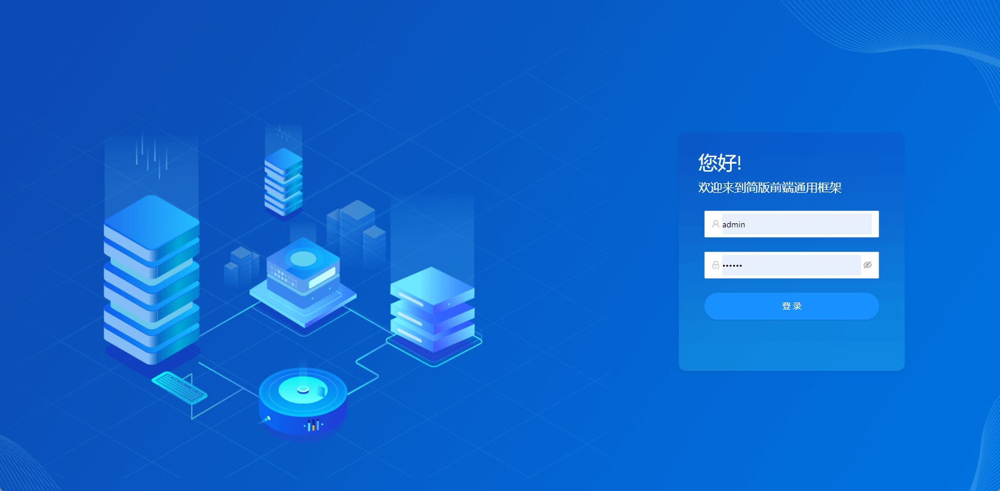

# 介绍

      

它基于 vue3、vite、typescript 和 ant-design实现。它使用了最新的前端技术栈，开箱即用不含任何无用组件及代码， 内置3.0版本按需加载解决方案，动态路由，权限验证，提炼了典型的业务模型，提供了实用的功能组件，它可以帮助你快速搭建企业级中后台产品原型。相信不管你的需求是什么，本项目都能帮助到你。

::: tip 建议

本项目在不断更新维护，更多组件也会在后续的版本中开发迭代，因为不能确定你是否需要这些组件，节省你删除无用组件与代码的时间，框架保证主分支(master)的极简性，更多组件会放在component分支开发。更多新功能也会在其余分支进行开发。
:::

::: tip 预览

[在线Demo-待部署](/)  
账号：admin | 密码：123456
:::

## 功能

``` sh
- 登录 / 注销

- 权限验证
  - 页面权限
  - 指令权限
  - 权限配置
  - 二步登录

- 全局功能
  - 动态侧边栏（支持多级路由嵌套）
  - 动态面包屑
  - 快捷导航(标签页)
  - antd 图标封装
  - 自适应侧边栏
  - mock
  - 国际化

- 表格
  - 高度自定义表格
  - 满足日常增删改查功能
  - 表单输入组件丰富
  - 百行代码实现复杂功能

- 错误页面
  - 403
  - 404
  - 500

- 组件
  - 表格
  - 图标icon

```

## 前序准备

你需要在本地安装 [node](https://nodejs.org/en/)和 [git](https://git-scm.com/)。本项目技术栈基于 [es6](https://es6.ruanyifeng.com/)、[vue3](https://v3.cn.vuejs.org/)、[vue-router](https://next.router.vuejs.org/zh/)、[vite](https://vitejs.cn/)、[axios](http://www.axios-js.com/zh-cn/docs/)、和 [ant design](https://2x.antdv.com/docs/vue/introduce-cn/)，所有的请求数据都是使用mock进行模拟，提前了解和学习这些知识会对使用本项目有很大的帮助。

:::tip 提示

框架内所有引用的类库（或组件）都需要是ts版本的，否则会引发程序运行报错或打包失败的可能，查看类库是否支持ts请[戳这里](https://www.typescriptlang.org/dt/search)，如果不支持需要自己编写引用类库的声明文件。
:::

## 目录结构

本项目已经为你生成了一个完整的开发框架，提供了涵盖中后台开发的各类功能和坑位，下面是整个项目的目录结构。

```sh
├── dist                       # 构建相关
├── public                     # 静态资源
│   │── favicon.ico            # favicon图标
├── src                        # 源代码
│   ├── assets                 # 主题 字体等静态资源
│   ├── components             # 全局公用组件
|   ├── config                 # 全局配置
│   ├── errorPages             # 错误页
|   ├── hooks                  # hooks
│   ├── layout                 # 全局 layout
|   ├── locales                # 国际化
|   ├── mock                   # mock 数据
│   ├── router                 # 路由
│   ├── services               # axios请求封装
│   ├── store                  # 全局 store管理
│   ├── types                  # 接口、页面ts类型约束
│   ├── utils                  # 全局公用方法
│   ├── views                  # views 所有页面
│   ├── App.vue                # 入口页面
│   └── main.ts                # 入口文件 加载组件 初始化等
├── .env.xxx                   # 环境变量配置
├── index.html                 # html模板
├── tsconfig.json              # ts配置文件
├── vite.config.ts             # vite配置文件
└── package.json               # package.json

```

## 安装

```shell
# 克隆项目
git clone https://github.com/mrhaoxiaojun/vue3-antd-admin.git

# 进入项目目录
cd vue3-antd-admin

# 安装依赖
npm install

# 设置淘宝镜像代理
npm install --registry=https://registry.npm.taobao.org

# 本地开发 启动项目
npm run dev

```

::: tip 提示

遇到npm安装失败的问题请尝试切换到淘宝镜像
:::

启动完成后会自动打开浏览器访问 http://127.0.0.1:3000， 你看到下面的页面就代表操作成功了。

[](../imgs/login.jpg)

接下来你可以修改代码进行业务开发了，本项目内建了典型业务模板、常用业务组件、模拟数据、状态管理、全局路由等等各种实用的功能来辅助开发，你可以继续阅读和探索左侧的其它文档。

:::tip 建议

你可以把仓库的component分支当做工具箱或者集成方案仓库，在master主分支的基础上进行二次开发，想要什么功能或者组件就去component分支那里复制过来。
:::

## 反馈建议

有任何修改和建议都可以为该项目 pr 和 issue。

还在持续迭代中，逐步沉淀和总结出更多功能和相应的实现代码，总结中后台产品模板/组件/业务场景的最佳实践。本项目也十分期待你的参与和反馈。


## IDE

使用vue3.0版本开发强烈建议你将 [VS Code](https://visual-studio-code.en.softonic.com/)安装Vue Language Features (Volar)这款插件，并禁用Vetur插件。

## 捐赠

如果你觉得这个项目帮助到了你，点个赞 ❤️