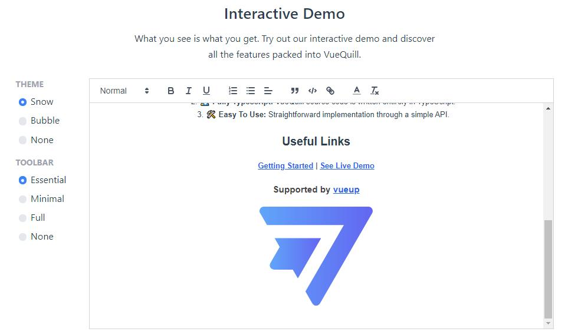

# 引入外部模块

除了 antDesign-ui 组件以及脚手架内置的业务组件，有时我们还需要引入其他外部组件，这里以引入 [@vueup/vue-quill ](https://vueup.github.io/vue-quill/)为例进行介绍。

注意

引入的外部组件必须支持ts，可以是ts编写的，也可以是提供了相应的声明文件。
[验证引入的组件是否支持ts，点击这里->](https://www.typescriptlang.org/dt/search?search=)

## 引入依赖

在终端输入下面的命令完成安装：

```shell
npm install @vueup/vue-quill@beta --save
# OR
yarn add @vueup/vue-quill@beta

```

> 加上 `--save` 参数会自动添加依赖到 package.json 中去。

## 使用

### 全局注册

main.ts

```ts
import { QuillEditor } from '@vueup/vue-quill'
const app = Vue.createApp({...})
app.component('QuillEditor', QuillEditor)

```

```vue
<template>
  <QuillEditor toolbar="full" contentType="html" ref="quill" style="height: 300px;" />
</template>

```

### 局部注册

```vue
<template>
  <QuillEditor toolbar="full" contentType="html" ref="quill" style="height: 300px;" />
</template>
<script>
import { QuillEditor } from '@vueup/vue-quill'
export default {
  components: { QuillEditor }
}
</script>

```

[](../imgs/edit.jpg)

## 在 vue 中优雅的使用第三方库

vue3.0不是很推荐这样使用，作为拓展吧

在 Vuejs 项目中使用 JavaScript 库的一个优雅方式是将其代理到 Vue 的原型对象上去. 按照这种方式, 我们引入 Moment 库:

main.ts

```ts
import { createApp } from 'vue'
import App from './App.vue'
import moment from 'moment'

const app = createApp(App)

Object.defineProperty(app.config.globalProperties '$moment', { value: moment })

```

实例中都可以通过 this.$moment. 的方式访问 Moment 而不需要定义全局变量或者手动的引入，setup使用this是强烈反对的，你只能在setup的生命周期中使用 [getCurrentInstance ()](https://v3.cn.vuejs.org/api/composition-api.html#getcurrentinstance)来获取this

```ts
<script>
import { onMounted, getCurrentInstance } from 'vue'
export default {
  setup () {
    onMounted(() => {
      const self = getCurrentInstance()
      console.log(self.$moment().format('HH:mm'))
    })
  }
}
</script>

```

## 自己封装一个非 vue 组件

很多时候我们会发现，有些组件并没有 vue 版本，其实在 vue 中引入第三方组件是很简单的。只要在合适的生命周期里面初始化它就好了。一般在 mounted中，之后和正常使用它就没什么区别了。
详细的可见文章：手摸手，带你封装一个 [vue component](https://segmentfault.com/a/1190000009090836)