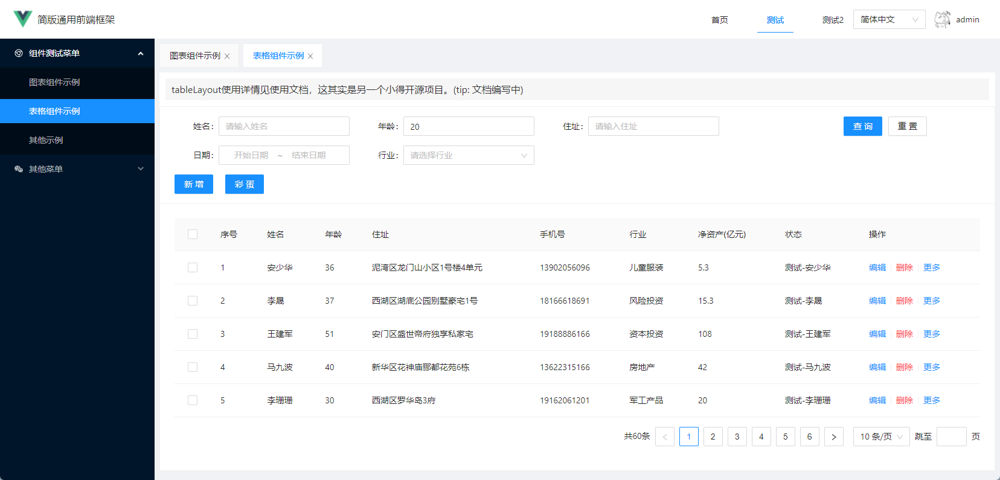

# 布局

页面整体布局是一个产品最外层的框架结构，往往会包含导航、侧边栏、面包屑以及内容等。想要了解一个后台项目，先要了解它的基础布局。

## Layout

[](../imgs/layout.jpg)


@ 是 vite 的 [resolve.alias ](https://vitejs.cn/config/#resolve-alias)不懂得请自行研究，下面附配置代码

```ts
// vite.config.ts
export default defineConfig({
  resolve: {
    alias: {
      '@': path.resolve(__dirname, 'src')
    }
  }
})

```

```json
// tsconfig.json
{
  "compilerOptions": {
    "paths": {
      "@/*": ["src/*"]
    }
  }
}

```

框架 中大部分页面都是基于这个 `layout` 的，除了个别页面如：`login` , `404`, `403` 等页面没有使用该`layout`。如果你想在一个项目中有多种不同的layout也是很方便的，只要在一级路由那里选择不同的layout组件就行。

```ts
// No layout
{
  path: '/401',
  component: () => import('errorPage/401')
}

// Has layout
{
  path: '/documentation',

  // 你可以选择不同的layout组件
  component: Layout,

  // 这里开始对应的路由都会显示在app-main中 如上图所示
  children: [{
    path: 'index',
    component: () => import('documentation/index'),
    name: 'documentation'
  }]
}

```

这里使用了 [vue-router 路由嵌套 ](https://next.router.vuejs.org/zh/guide/essentials/nested-routes.html), 所以一般情况下，你增加或者修改页面只会影响 `tabView` 这个主体区域。其它配置在 layout 中的内容如：侧边栏或者导航栏都是不会随着你主体页面变化而变化的。

```sh
/foo                                  /bar
+------------------+                  +-----------------+
| layout           |                  | layout          |
| +--------------+ |                  | +-------------+ |
| | foo.vue      | |  +------------>  | | bar.vue     | |
| |              | |                  | |             | |
| +--------------+ |                  | +-------------+ |
+------------------+                  +-----------------+

```

当然你也可以一个项目里面使用多个不同的 layout，只要在你想作用的路由父级上引用它就可以了。

## tabView

tabView：头部选项菜单,内部包含的 router-view 为主页面视图，这里栏目下的直接页面称为一级页面，菜单下的页面称为二级页面，菜单下又进行嵌套菜单的称为多级页面，无论是一级页面、二级页面、多级页面tabView都是展示他们的顶级窗口。


框架内tabView对应的公共component名称：BasicLayout

## routerView


二级页面、多级页面的视图窗口，他与tabView的关系如下所示。一级页面的视图窗口属于tabView，二级、多级的视图窗口属于routerView，这点会在路由缓存中得到提现。

```sh
+------------------+
| tabView          |
| +--------------+ |
| | routerView   | |
| | （可嵌套）    | |
| +--------------+ |
+------------------+


```

框架内tabView对应的公共component名称：BlankView

至此你应该知道了路由菜单的基础配置内容是如何产生的：

```ts
[
  { 
    name: '栏目',
    component: 'BasicLayout',
    children: [
      {
        name: '菜单',
        component: 'BlankView',
        children: [
          {
            name: '页面',
            component: '/element/icon',
          }
        ]
      }
    ]
  }
]

```

## menu & header

在`@/layout/menu`存放菜单部分，他通过菜单接口动态渲染成型并应用 vuex 管理全局状态。

在`@/layout/header`存放头部部分，他的右侧是顶级栏目的列表，且宽度自适应超出滚动，数据来源于 vuex 管理的 router (接口获取)， 他的右侧是头像与用户名，通过info接口获取vuex全局管理。

## 移动端

ant-design 官方对自己的定位是桌面端后台框架，而且对于管理后台这种重交互的项目来说是不能通过简单的适配来满足桌面端和移动端两端不同的交互，所以真要做移动版后台，建议重新做一套系统。
