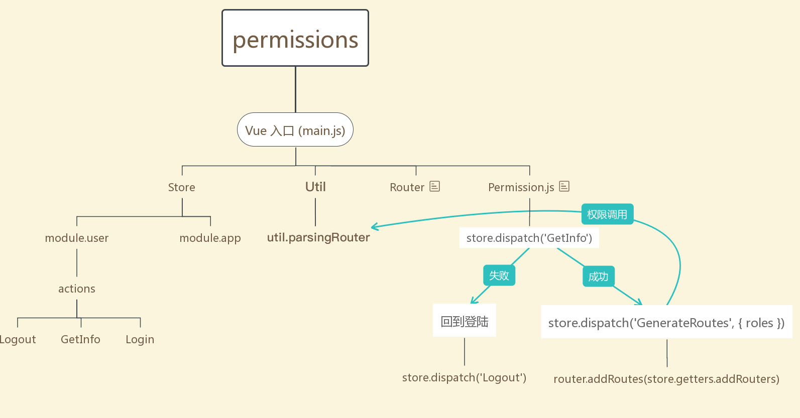
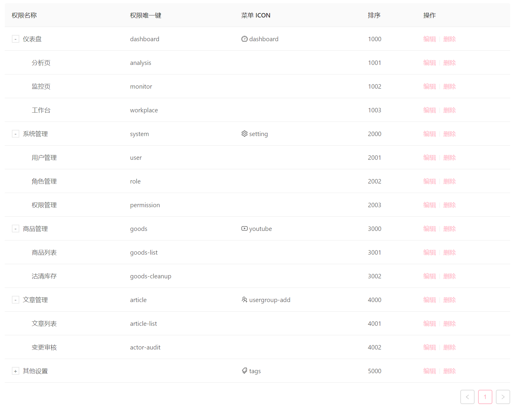
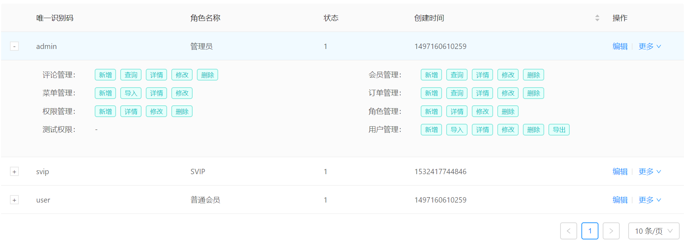

# 权限验证

vue3-antd-admin 提供了两套权限实现思路，其中方案一为前端固定路由表和权限配置，由后端提供用户权限标识，来识别是否拥有该路由权限。方案二为后端提供权限和路由信息结构接口，动态生成权限和菜单。
本框架采用方案二，用户进行登录操作获取动态路由表，通过 `router.addRoute` 动态挂载到路由上，其中 `router/basics.router.ts` 为基础路由部分，会在项目加载时自动注入，如果你想通过方案一的方式进行权限配置可以改造该文件。

[](../imgs/permission.jpg)

## 登陆逻辑

前置路由拦截器检测到 localStorage 中没有token，或者是store存储的用户信息不存在，就会跳转到登录界面。用户输入正确的用户名和密码即可进入首页。登录接口需要返回符合ts接口约束的数据。

具体步骤如下

1. 判断是否有 token 如果没有则跳转到登录页面
2. 获取用户信息和拥有权限store.dispatch('GetInfo')
3. 用户信息获取成功后, 调用 store.dispatch('user', userInfo) 根据获取到的用户信息构建出一个已经过滤好权限的路由结构(src/utils/parsingRouter.ts)
4. 将构建的路由结构信息利用 Vue-Router 提供的动态增加路由方法 router.addRoutes 加入到路由表中
5. 加入路由表后将页面跳转到用户原始要访问的页面,如果没有 redirect 则进入默认页面 (/)

这里可以看出把 登录 和 获取用户信息 分成了两个接口，主要目的在于当用户刷新页面时，可以根据登录时获取到的身份令牌（cookie/token）等，去获取用户信息，从而避免刷新需要调用登录接口 admin 实现的路由权限的控制代码都在 @/router/permission.js 中，如果想修改逻辑，直接在适当的判断逻辑中 next() 释放钩子即可。 两套权限实现 均使用 @/router/permission.js （路由守卫）来进行控制。

登录接口需要返回的数据

```ts
export type UserState = {
  token: string,
  name: string,
  avatar: string,
  roles: string[],
  routers?: RouterTable
}

```

RouterTable

```ts
// 路由对象约束
export interface RouterObj {
  id: number,
  path: string,
  name: string,
  component: string,
  key: string,
  redirect?: string,
  icon?: string,
  children?: RouterObj[],
  pid?: number,
  hidden?: boolean,
  keepAlive?: boolean
}

// 路由数组约束
export type RouterTable = RouterObj[]

```

如果你需要修改登录页面在 `view/login` 修改即可，如果需要添加验证码或其他字段，除了在页面中添加html外，还需要在 `types/view/login.ts` 中对应的类型约束添加新增的字段名称。

types/view/login.ts

```ts
export type LoginFrom = {
  username: string | undefined,
  password: string | undefined
}

```

## 动态路由管理页面

因为无法确定和统一使用者的业务需求，动态路由管理页面目前框架内没有内置，这里给大家一个推荐布局（树表格），或者使用树+表格

[](../imgs/authority.png)

## 指令权限

后续开发中......

## 按钮级鉴权

很多公司的业务逻辑可能涉及到复杂的按钮级权限，此时指令权限的方式似乎有些差强人意，这时候就需要与后台协调，根据api中间件的方式来鉴权，这样前端只需要提供角色对应api的绑定页面。

本框架内使用简单的指令权限，如果你真的需要颗粒化鉴权，这需要后台的支持。

参考页面：

[](../imgs/eg.png)