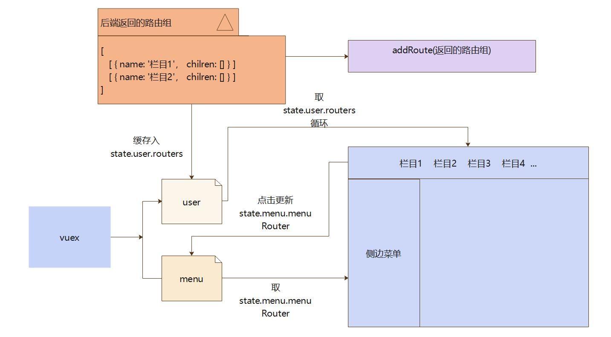
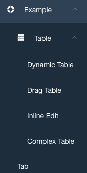
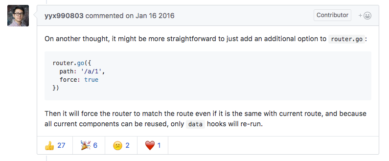
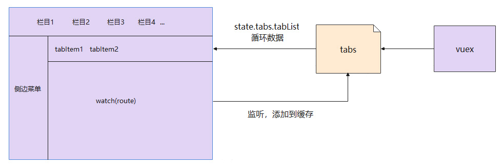

# 路由和侧边栏

路由和侧边栏是组织起一个后台应用的关键骨架。

本项目解决了侧边菜单过多所带来的痛点。其他框架的痛点问题：菜单过多导致的展示不全需要来回滚动、多种菜单无法分类展示、需要顶部栏目的系统无法实现。本框架解决方式：在header位置添加栏目列表，各个栏目下的子集为侧边菜单，切换栏目侧边菜单联动切换。

路由采用静态路由加动态路由的方案，使得路由数据前后分离后端鉴权更加容易。静态路由存放本地无需鉴权（例如404页面、登陆页面），动态路由通过接口获取并添加。

:::tip 不需要动态路由
如果不需要动态路由，关闭权限过滤功能，全局配置filterMenu设置为false，自行维护`router/static.router.ts`文件
:::

## 路由配置项

首先我们了解一下本项目配置路由时提供了哪些配置项。

```ts
interface RouterObj {
  // 菜单id
  id: number,
  // 路由地址
  path: string,
  // 菜单名称
  name: string,
  // 相对于views文件夹的模板文件的相对位置
  component: string,
  // 路由名称
  key: string,
  // 重定向地址
  redirect?: string,
  // 菜单图标
  icon?: string,
  // 菜单子集，页面级无需配置
  children?: RouterObj[],
  // 父级id
  pid?: number,
  // 是否隐藏页面/菜单，默认false不隐藏
  hidden?: boolean,
  // 是否缓存页面，默认false不缓存
  keepAlive?: boolean
}

```

框架路由配置项与vue-router配置的对应关系

| 框架路由配置项   | vue-router配置项  | 注释        |
| --------- | -------------- | --------- |
| id        | meta.id        | 路由元信息     |
| path      | path           | 路由地址      |
| name      | meta.title     | 路由元信息     |
| component | component      | 模板文件位置    |
| key       | name           | 路由名称（需唯一） |
| redirect  | redirect       | 重定向       |
| icon      | 无              | 框架特有      |
| children  | children       | 路由子集      |
| pid       | 无              | 框架特有      |
| hidden    | meta.hidden    | 路由元信息     |
| keepAlive | meta.keepAlive | 路由元信息     |

**示例**

后端返回示意：

```ts
[
  { 
    id: 1,
    pid: 0,
    name: '基础模板',
    path: '/',
    redirect: '/element/icon',
    component: 'BasicLayout',
    icon: 'AppleOutlined',
    key: 'layout',
    children: [
      {
        id: 2,
        pid: 1,
        name: '好用组件',
        path: '/element',
        redirect: '/element/icon',
        component: 'RouteView',
        icon: 'ChromeOutlined',
        key: 'element',
        children: [
          {
            id: 10,
            pid: 2,
            name: '图标组件',
            path: '/element/icon',
            redirect: '',
            component: '/element/icon',
            icon: '',
            key: 'el_icon',
            keepAlive: true
          },
          {
            id: 11,
            pid: 2,
            name: '表格组件',
            path: '/element/table',
            redirect: '',
            component: '/element/table',
            icon: '',
            key: 'el_table',
          },
          {
            id: 12,
            pid: 2,
            name: '详情',
            path: '/element/detail',
            redirect: '',
            component: '/element/detail',
            icon: '',
            key: 'detail',
            hidden: true
          }
        ]
      }
    ]
  }
]

```

## 路由模式

这里的路由分为两种，`constantRoutes` 和 `asyncRoutes`。

constantRoutes：代表那些不需要动态判断权限且配置在本地的路由，如登录页、404、等通用页面。

asyncRoutes：代表那些后端返回需要动态判断权限并通过 addRoute 添加的页面。

上边路由配置项配置的是动态路由，静态路由只需在本地按照vue-router格式配置 (src/router/basics.router.ts)即可

::: tip 提示

这里所有的路由页面都使用 路由懒加载 了 ，具体介绍见[文档](https://next.router.vuejs.org/zh/guide/advanced/lazy-loading.html)
:::

::: warning 注意事项

这里有一个需要非常注意的地方就是 404 页面一定要最后加载，需要在 addRoute 添加完后端路由后添加通配符404，如果提前配置会导致动态路由被拦击到404页面。(src/router/permission.ts)
:::

## 侧边栏

本项目侧边栏主要基于 ant-design 的 a-menu 改造。

侧边栏是通过后端接口返回的路由数组生成的，支持路由无限嵌套，路径、栏目、菜单相互联动，侧边栏显示的菜单为当前栏目的可视菜单。登陆后默认跳转地址"/"，这也要求你必须保证定义路经为"/"的路由，当然你可以修改这个地址。

::: tip 提示

修改登陆后默认跳转地址，只需要替换login.vue (src/views/login)中的'/'部分（80行附近）
:::

在后台返回路由组的时候会在vuex存入 state.user.routers ，这里缓存了整体路由列表，在header栏目生成时调取该缓存数据，取 state.user.routers index = 0的层级为栏目。

所选栏目的下属子路由存入 state.menu.menuRouter , 这里缓存了侧边栏路由列表，并且根据用户选择的不用栏目实时更新。侧边栏循环 state.menu.menuRouter ，每一项定义为item， item含有children为菜单，不含有的为页面。

**侧边栏逻辑图**

[](../imgs/menuul.jpg)

仔细阅读上图并查看源码，你会很快梳理通顺这部分的逻辑，根据路由地址进行的菜单与tab的联动也是在此基础之上开发的，如果你对这部分感兴趣可以继续深入了解(src/layout)部分的源代码。在侧边栏部分你只需要了解即可，因为这部分内容并不会影响到你的使用，除非你想DIY某些东西。

::: tip 提示

侧边栏菜单的打开与关闭是[antd menu](https://2x.antdv.com/components/menu-cn#API)组件提供的支持
:::

## 

如果你的路由是多级目录，不要忘记在菜单部分设置component: BlankView，原则上有多少级路由嵌套就需要多少个BlankView（除顶级栏目和页面）。

```ts
[
  {
    name: '栏目一'
    component: 'BasicLayout',
    children: [
      {
        name: '菜单一'
        component: 'BlankView'
        children: [
          {
            name: '菜单嵌套层一'
            component: 'BlankView'
            children: []
          }
        ]
      }
    ]
  }
]

```

**component**  
为BasicLayout是框架主体部分，栏目需设置；  
为BlankView是视图窗口，菜单需设置。

[](../imgs/nested.png)

## 点击侧边栏 刷新当前路由

在用 spa(单页面应用) 这种开发模式之前，用户每次点击侧边栏都会重新请求这个页面，用户渐渐养成了点击侧边栏当前路由来刷新 view 的习惯。但现在 spa 就不一样了，用户点击当前高亮的路由并不会刷新 view，因为 vue-router 会拦截你的路由，它判断你的 url 并没有任何变化，所以它不会触发任何钩子或者是 view 的变化。[issue ()](https://github.com/vuejs/vue-router/issues/296)地址，社区也对该问题展开了激烈讨论。

[](../imgs/ydd.png)

尤大本来也说要增加一个方法来强刷 view，但后来他又改变了心意/(ㄒ o ㄒ)/~~。但需求就摆在这里，我们该怎么办呢？他说了不改变 current URL 就不会触发任何东西，那我可不可以强行触发你的 hook 呢？上有政策， 下有对策我们变着花来 hack。方法也很简单，通过不断改变 url 的 query 来触发 view 的变化。我们监听侧边栏每个 link 的 click 事件，每次点击都给 router push 一个不一样的 query 来确保会重新刷新 view。

::: tip 注意

这里只是提供给大家一个解决思路，实际框架内点击侧边栏是没有添加刷新功能的。
:::

```ts
clickLink(path) {
  this.$router.push({
    path,
    query: {
      t: +new Date() //保证每次点击路由的query项都是不一样的，确保会重新刷新view
    }
  })
}

```

ps:不要忘了在 router-view 加上一个特定唯一的 key，如 `<router-view :key="$route.path"></router-view>`， 但这也有一个弊端就是 url 后面有一个很难看的 query 后缀如 xxx/article/list?t=1496...，当然你可以从前面的 issue 中知道还有很多其它方案。

**相关例子**

这里在介绍一种比较推荐的方案（来自[潘大神](https://github.com/PanJiaChen)），现在采取的方案是判断当前点击的菜单路由和当前的路由是否一致，若一致的时候，会先跳转到一个专门 Redirect 的页面，它会将路由重定向到我想去的页面，这样就起到了刷新的效果了。

1、点击的时候重定向页面至 `/redirect`

```ts
const { fullPath } = this.$route
this.$router.replace({
  path: '/redirect' + fullPath
})

```

2、`redirect` 页面在重定向回原始页面

```ts
// redirect.vue
// https://github.com/PanJiaChen/vue-element-admin/blob/master/src/views/redirect/index.vue
export default {
  beforeCreate() {
    const { params, query } = this.$route
    const { path } = params
    this.$router.replace({ path: '/' + path, query })
  },
  render: function(h) {
    return h() // avoid warning message
  }
}

```

## 面包屑（快捷导航栏）

本项目中的tab切换栏充当面包屑的，如果需要传统的面包屑扩展一下即可，核心代码是围绕`route.matched`进行的

[](../imgs/crumbs.png)

通过监听路由变化（`watch $route`）vuex动态缓存新访问的路由，在template内循环读取vuex缓存的数据，来展示出历史访问面包屑。在 `menu.vue` 你可以参照 `route.matched` 相关代码添加当前访问面包屑。

[](../imgs/breadCrumbs.jpg)


历史面包屑点击相应的 tabItem 可以切换到点击的路由，右击 tabItem 可以打开操作菜单，在菜单中可以进行关闭的相关操作。

## 侧边栏滚动问题

现在许多前端框架容易忽略的一个问题，就是菜单过多超出预设 `100vh` 的时候，只是隐藏不显示没有进行滚动。该框架进行了css方面的优化处理，很好的规避了这种问题，并有美化了滚动条使他不在是难看的原生滚动条。

```css
.layout {
  & .ant-layout-sider-children {
    overflow-y: auto;
    overflow-x: hidden;
  }
  & .ant-layout-sider-children::-webkit-scrollbar {
    width: 4px;
  }
  & .ant-layout-sider-children::-webkit-scrollbar-thumb {
    border-radius: 10px;
    box-shadow: inset 0 0 5px #d8d8d8;
    background: #535353;
  }
  & .ant-layout-sider-children::-webkit-scrollbar-track {
    box-shadow: inset 0 0 5px #d8d8d8;
    background: #ededed;
  }
}

```

## 侧边栏默认展开

某些场景下，用户需要默认展开侧边栏的某些sub-menu，如下图：

[](../imgs/nested.png)

可以通过初始化设置 a-menu 的 openKeys 来达到目的，首先找到侧边栏代码(src/layout/menu)

```ts
setup() {
  const openKeys = ref<string[]>(['1', '2'])
}

```

具体的逻辑代码你可以根据具体的业务需求编写。