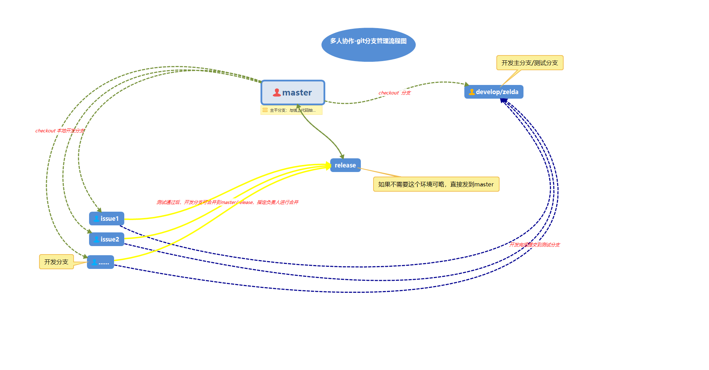
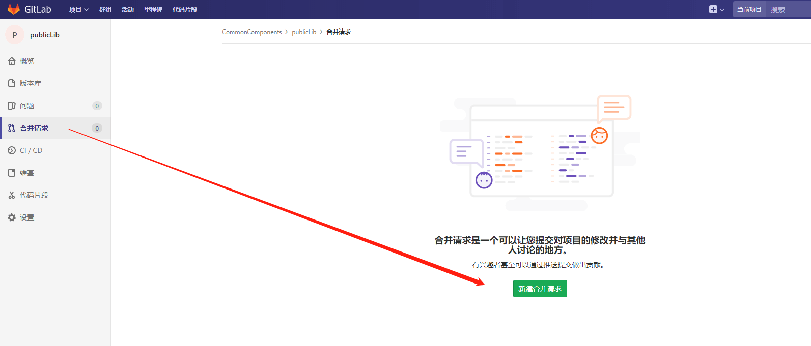
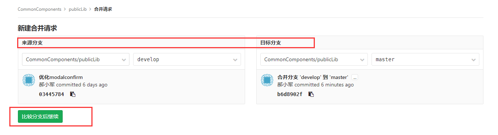
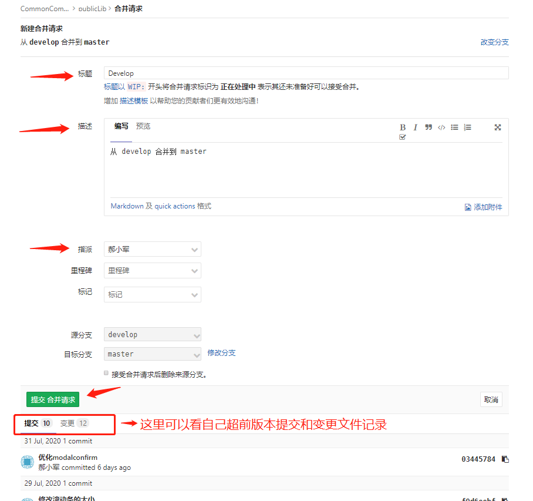
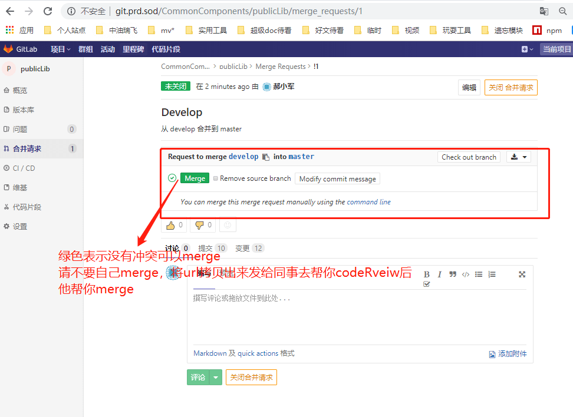
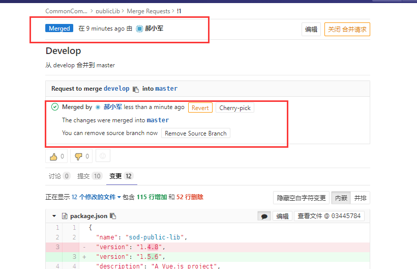

## 分支管理

| 分支	      | 命名	    | 环境         | 说明  |
| -----------|:---------|-------| -----|
| 主分支      | master    | 生产环境  |主分支，所有提供给用户使用的正式版本，都在这个主分支上发布 |
| 预发布分支   | release   | 预发布环境  | 这个环境中，一般会连接生产环境的数据库，使用生产环境的数据来进行测试。|
| 测试分支     | zelda     | 测试环境  | 如无特殊要求，可与开发分支共用一个分支(develop) |
| 开发主分支   | develop   | 开发环境  | 开发主分支,可供开发人员查看发布后的效果 |
| 开发分支     | issue*    | -        | 创建issue: 打开gitlab-》问题-》新建问题-》填写需求标题&描述&指派给自己-》提交问题-》回到问题列表页面可以看到问题的序号会依次累加，分支名字请用issue1,2,3,4...  issue拼接问题序号 |

## 多人协作

| 分支	           | 说明  |
| ----------------|-----|
| 主分支           | 1、只能被merge（不可在此进行开发） 2、修改权限只开改负责人 3、始终与线上代码保持一直 |
| 预发布分支         | 同主分支一样 |
| 开发主分支/测试分支  | 1、只能被更改，push或解决合并冲突（不可在此进行开发） |
| 开发分支          | 1、每个人在开发一个需求的时候，请建立自己的开发分支 2、当开发完毕，提交至develop，运维构建develop分支，测试进行测试 3、测试通过后，将当前分支merge至master，merge前先将master分支merge到开发分支，在本地处理冲突后，在由于开发分支merge到master 4、如多人需求耦合很大，请在一个issue分支进行开发，拒绝在develop直接开发 5、创建issue，打开gitlab-》问题-》新建问题-》填写需求标题&描述&指派给自己-》提交问题-》回到问题列表页面可以看到问题的序号会依次累加，分支名字请用issue1，2，3，4...  issue拼接问题序号 6、合并代码，请使用gitlab的，版本库-compare进行对比，然后进行创建合并请求，然后通知有权限进行合并的人进行codeReview后合并 |

### 传统分支管理(当前采用)

适用于长期需求大版本迭代、功能较多，且需要统一发版，统一测试，比较有版本驱动的节奏

| 分支	           | 特别说明  |
| ----------------|-----|
| 开发主分支/测试分支  | 测试完成后，整体迁移merge到下一个环境分支 |

举例：
1、开发主分支与测试分支共用一个分支develop  
2、issue1、issue2、issue3 开发完成，分别merge至develop（merge前，请先将develop代码同步到本地分支，然后在merge回去）
3、测试完成测试，给master分支打tag后，将develop分支merge到master分支完成上线

### 敏捷分支管理(当前未采用可略看)

适用于完善的产品项目，短期需求不断迭代优化更新
| 分支	           | 特别说明  |
| ----------------|-----|
| 开发主分支/测试分支  | 不可提交至master或merge到本地分支,以免其他未上线他人代码污染本地个人分支和master |

### codeReview流程规范

* 第一次进来会会让你新建合并请求

* 然后选择你的来源分支和目标分支(就是从哪个分支合并到哪个分支)

* 接下来填写合并的描述信息,包括可以看到自己的提交记录和文件变更记录

* 提交合并请求后,看到页面里的merge按钮,绿色的代表没有冲突,可以合并,请这个时候,点一下下方**变更**的页签后,看到变更的文件和代码,这个时候将url地址拷贝出来发给你的同事,帮你codeReview之后,再由同点击merge帮你完成合并

* 如果merge不是绿色的,代表有问题,会有冲突的提示,你需要反向用命令将目标分支合并到自己分支,在自己分支上解决完冲突后,再回到这个页面刷新发现可以merge了

* 完成merge 可以通知发起人

## Git推荐教程(选看)
[官网](https://www.git-scm.com/docs)

[廖雪峰老师-浅显易懂的](https://www.liaoxuefeng.com/)

[白丁-简版教程](https://mrhaoxiaojun.gitee.io/ibooks/course/git/intro.html)